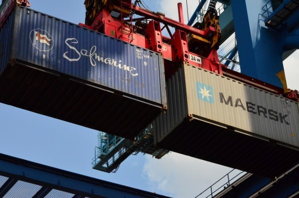
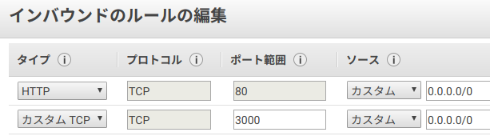

<!-- 
$size: 16:9
$theme: gaia
page_number: true
footer: @k_nishijima
-->

# JAWS-UG沖縄 AWS Fargateハンズオン



## 2018年9月29日 @k_nishijima

---

# 今回のハンズオンの流れ

## ざっくり以下の流れで行きます

* ローカルでWebアプリを作る
* それをコンテナ環境で動くようにする
* 更にそれをFargateにデプロイする

それでは行ってみましょう！

---

# 事前準備

## 必要なもの

* AWSアカウント（持ってない人！
* ローカルで動くdocker
* Node.js環境（サンプルWebアプリを動かすため：実装は何でも良いです）

---

# 参考資料（というか元ネタ）

こちらのサイトを参考にさせていただきました！
ありがとうございますm(_ _)m

* https://qiita.com/IgnorantCoder/items/d4f16b1aadd1c03c0e26

資料は多分この辺に上がります（最近slideshareがおかしいから多分sdかな。。。）

* https://www.slideshare.net/KoichiroNishijima/presentations
* https://speakerdeck.com/knishijima


---

# その1：ローカルで動くWebアプリ

## package.json作成

package.jsonを以下で作成（参考資料のままだとカンマがあって動かなかったので注意です(^_^;)

```
{
  "private": true
}
```

---

# その1：ローカルで動くWebアプリ

## 依存関係追加

利用パッケージとしてexpressとmorgan(loggerです)を追加

```
$ npm install --save express morgan
```

---

# その1：ローカルで動くWebアプリ

## Webアプリ本体

server.js を作成（はみ出すので[ここに張ってます](https://gist.github.com/k-nishijima/7d43e9230b40d9651e4d59634c8fba24)）

---

# その1：ローカルで動くWebアプリ

## Webアプリ実行

```
$ node ./server.js
```

Webブラウザで http://localhost:3000 にアクセスしてみてください。

---

# その2：コンテナで動くようにする

以下のような Dockerfile を作成

```
FROM node:alpine
WORKDIR /tmp
ADD package.json ./
ADD server.js ./
RUN npm install

EXPOSE 3000
EXPOSE 3001

CMD ["node", "./server.js"]
```

---

# その2：コンテナで動くようにする

ビルドして、、、

```
$ sudo docker build -t handson/server.js .
```

起動（ローカルのポート3000番とコンテナの3000番を接続）

```
$ sudo docker run -p 3000:3000 -d handson/server.js
```

またまた、Webブラウザで http://localhost:3000 にアクセスしてみてください。

---

# その2：コンテナで動くようにする

稼働中のコンテナの確認

```
$ sudo docker ps
CONTAINER ID        IMAGE               COMMAND              CREATED              STATUS              PORTS                              NAMES
60857bcc1f00        handson/server.js   "node ./server.js"   About a minute ago   Up About a minute   0.0.0.0:3000->3000/tcp, 3001/tcp   upbeat_liskov
```

停止

```
$ sudo docker kill 60857bcc1f00
```

---

# ここまではOK?

---

# その3：Fargateにデプロイ

## AWS側の設定（ざっくり3ステップ）

1. IAMの設定
    * ECRへのリポジトリへのpush権限を作る
    * ECSでのタスク実行権限を作る

2. ECRの設定
    * Registoryの作成
    * イメージ作成とプッシュ

---

# その3：Fargateにデプロイ

3. ECSの設定
    * Task definitionの作成
    * Clusterの作成
    * Serviceの作成

---

# IAMの設定

* https://qiita.com/IgnorantCoder/items/d4f16b1aadd1c03c0e26#iam%E3%81%AE%E8%A8%AD%E5%AE%9A

を参考にしましょう！（手抜きでスマンす(^_^;)

やっていることは、以下のとおりです。そこで追加したアカウントをAWS CLIを使うようにしてください。

* ECRにpush権限を持つグループを作って
* そこにユーザーを追加（or 自分のユーザーをそこに追加）
* ESC実行用のロールを作成


---

# ECRの設定

まずリポジトリを作成します。
ServicesからElastic Container Serviceを選んだら、画面左のリポジトリをクリックします。あ、 **東京リージョン** が選択されていることを忘れずに確認！

* リポジトリ名は「jawsug/handson」などと区別しやすいものを
* 作成したあとの説明のとおりに作業します、、、が、ハマると思いますので以下詳しく書きます

---

# ECRの設定

1. レジストリに対して Docker クライアントを認証するために使用するログインコマンドを取得します。

は、以下のように``--profile`` でプロファイル名を指定して実行してください。dockerの設定にもよると思いますが、linuxだとsudo必要です。

```
sudo $(aws ecr get-login --no-include-email --region ap-northeast-1 --profile default_handson)
```

---

# ECRの設定

3. 以下のコマンドを使用して、Docker イメージを構築します。以下略〜

先ほどと別のタグ名ですが、ビルドします（前のイメージと同じ状態であれば、すぐ終わると思います）。

```
$ sudo docker build -t jawsug/handson .
```

---

# ECRの設定

4. 構築が完了したら、このリポジトリにイメージをプッシュできるように、イメージにタグを付けます:

```
sudo docker tag jawsug/handson:latest 539559780906.dkr.ecr.ap-northeast-1.amazonaws.com/jawsug/handson:latest
```

---

# ECRの設定

5. 以下のコマンドを実行して、新しく作成した AWS リポジトリにこのイメージをプッシュします:

繰り返しになりますが、linux環境の場合sudoが必要な場合があります。

```
$ sudo docker push 539559780906.dkr.ecr.ap-northeast-1.amazonaws.com/jawsug/handson:latest
```

pushが終わったら「完了」をクリックしましょう。
画面にプッシュしたイメージが表示されるはずです！

---

# あと一息！

ここまでで

* Dockerイメージを作って
* ECRに登録

までが出来たことになります。
最後に、登録したイメージをECSで動かします。

---

# ECSの設定

Amazon ECSのメニューから

* タスク定義をして
* クラスターを作ります

（メニューの並びと逆順なので注意(^_^;)

---

# ECSの設定：タスク定義

* もちろんタスク定義はFargateで作成してください
* タスク定義名（何でも良いのですが）は「handson-task」などとしておいてください
* タスクロールは今回は「なし」で良いです
* タスクの実行IAMロールは、先程IAMで作成した ecsTaskExecutionRole を選択します。
* タスクサイズは、メモリもCPUも最小を選んでおいてください（勿論大きければ大きいほどお金がかかります）

---

# ECSの設定：コンテナの定義

* コンテナ名は適当に「handson」など
* イメージは先程pushした「539559780906.dkr.ecr.ap-northeast-1.amazonaws.com/jawsug/handson:latest」 などという感じで指定します
* ポートマッピングで3000:TCPを設定するのをお忘れなく

最後に「作成」をクリックして完了です。

---

# ECSの設定：クラスター作成

* Amazon ECSのメニューからクラスターを選択、「クラスターの作成」をクリック
* 「ネットワーキングのみ」を選択して、名前をつけます。
* VPCは専用に作っても良いです（作成しない場合、あとで既存のVPCから選ぶことになります）
* 「表示」をクリックして、そのままサービスを作成してしまいましょう

---

# ECSの設定：サービスの設定

* サービス名は適当に「handson-service」などと設定
* タスクの数は「1」で
* 次に進んで、ネットワーク構成はVPCの構成次第、、、
* パブリック IP の自動割り当てを「ENABLE」にしておけば、すぐにアクセスできるパブリックIPを割り当ててくれる
* 「サービスの検出の統合の有効化」のチェックを **外して** おく
* AutoScalingも利用しないように注意

最後に「サービスの作成」ですべてが作成される。

---

# これでクラスタが起動した！

* クラスター : handson の「タスク」タブのタスクをクリックすると、起動中のタスクのネットワークの状態などが確認できる
* Pubilc IPにアクセスすれば、動作確認可能、、、なんだけど、ここではセキュリティグループの設定が足りていないので、追加する必要あり
* ENIのIDをクリック、セキュリティグループをクリックして、インバウンドルールのカスタムTCPルールとしてポート3000を有効に



---

# 動作確認

* セキュリティグループでポート3000を許可したあと、Public IP:3000 にアクセスすると・・・ :heart:
* 実運用では必ず前段にALBを置くので、↑の設定は要らない
* ログは クラスター > handson > タスク:ID のコンテナ詳細 -> ログドライバー で確認可能です

---

# 後片付け

* 「クラスターの削除」を実行
* 時々1回で削除されないときがある？ -> その場合再度削除すればOK


---

# おまけ：コードを修正してコンテナを更新してみよう！

buildし直して、タグ付けして、pushし直して、最後に update-serviceで更新できるはずです！

```
$ docker build -t your-alias/sample-app .
$ docker tag your-alias/sample-app:latest xxxxxxxxxxxx.dkr.ecr.ap-northeast-1.amazonaws.com/your-alias/sample-app:latest
$ docker push xxxxxxxxxxxx.dkr.ecr.ap-northeast-1.amazonaws.com/your-alias/sample-app:latest
$ aws ecs update-service --cluster sample-app-cluster --service corporate-sample-app-http --force-new-deployment
```
